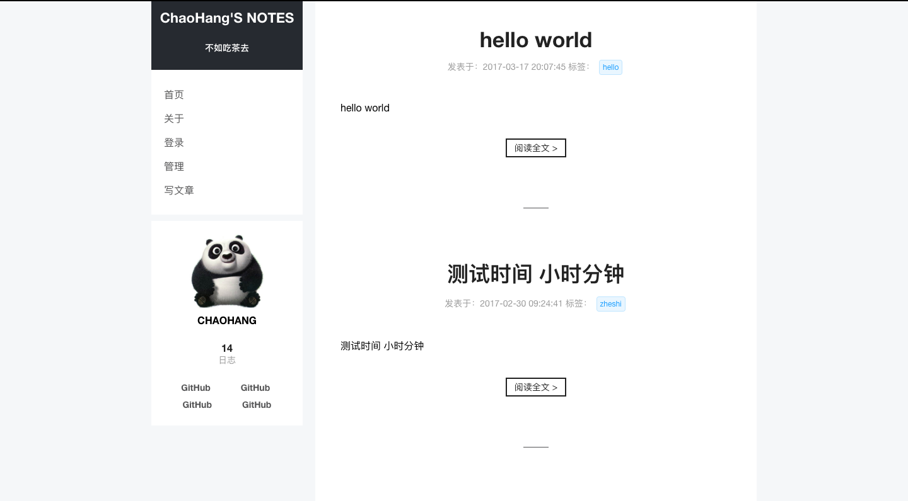
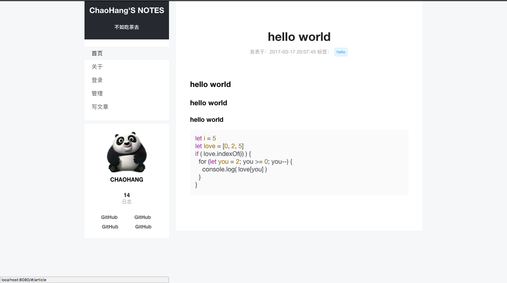
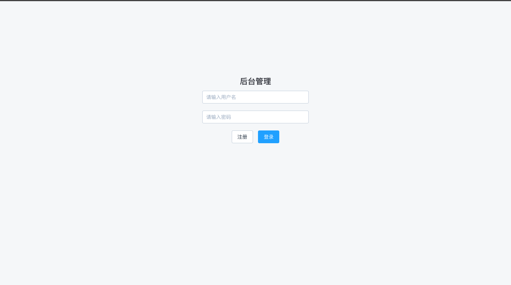
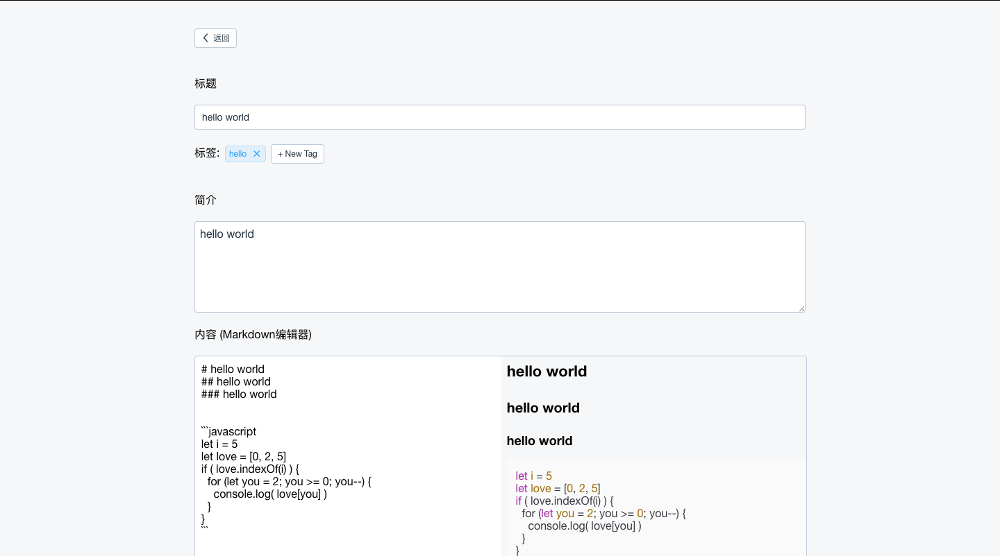

# blog

[《一个 Vue + Node + MongoDB 博客系统》](https://www.cnblogs.com/chaohangz/p/6748918.html)

## ENV
1. Node.js v6.9.4
2. MongoDB v3.4.1
3. Vue.js v2.2.1

## 实现的功能
1. 文章的编辑，修改，删除
2. 支持使用 `Markdown` 编辑与实时预览
3. 支持代码高亮
4. 给文章添加标签
5. 支持用户注册登录

## 使用到的技术
### 前端
1. Vue.js
2. vue-cli
3. vue-router
4. vue-resource
5. element-ui
6. marked
7. highlight.js

### 后端
1. Node.js
2. Express
3. Mongoose

## 项目目录

```
| app.js              后端入口
| index.html          入口页面
| .babelrc            babel配置
| .gitignore          git配置
| package.json
| webpack.config.js   webpack配置
|
|-dist                vue打包生成的文件
|
|-node_modules        模块
|
|-server              后端
    | check.js
    | db.js           数据库
 __ | router.js       路由
|
|-src               前端
    |-assets        静态资源
    |-components    组件
    | App.vue
    | main.js
```

## How to start
``` bash
# clone projext
git clone https://github.com/chaohangz/blog.git

# 安装依赖
cd blog
npm install

# 启动数据库
mongod

# 启动服务器
node app

# 启动前端开发者模式
npm run dev
```

## 截图

首页



详情页



登录页



后台管理页


编辑页



